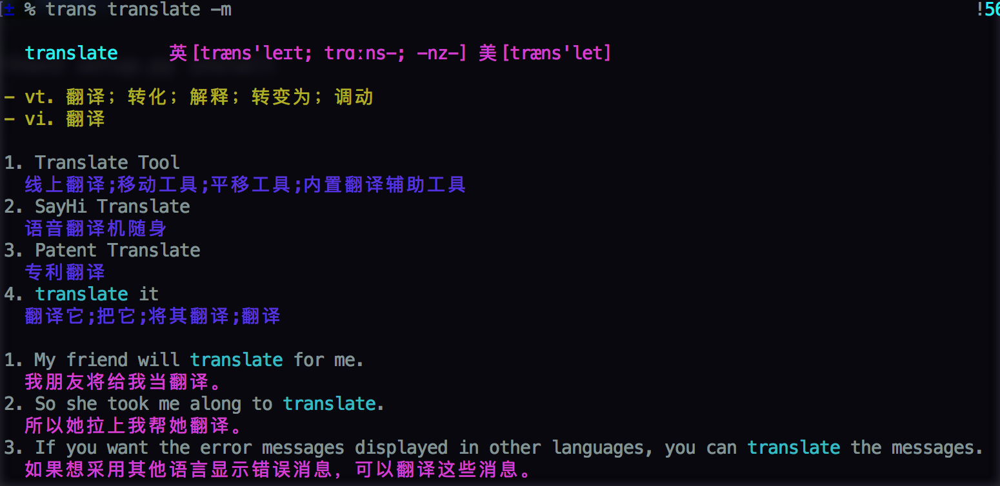

## trans

 A Simple Translation Tool In Your Command Line.



### Installation
```
python3 setup.py install
```

### Usage
Translate one word.
```
trans translate

trans 翻译
```
Translate the sentence.
```
trans Just Do it
```
Show more information.
```
trans translate -m

trans 翻译 -m
```


